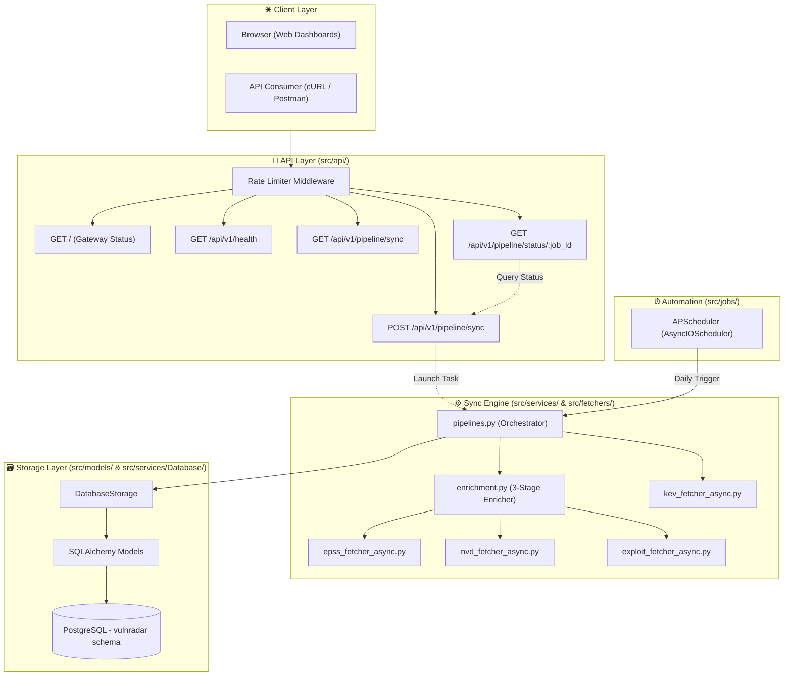
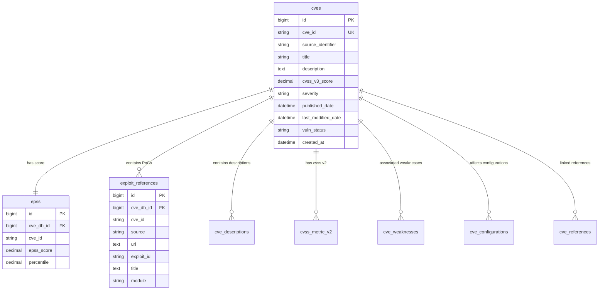

# VulnRadar — Project Description & Reference Guide

VulnRadar is an advanced, asynchronous Python-based vulnerability intelligence service. It aggregates, enriches, and stores vulnerability data from multiple authoritative public sources to provide security teams with a unified view of threat intelligence.

---

## 📡 Threat Intelligence Data Sources

VulnRadar pulls data from various endpoints to build a multi-layered profile of each vulnerability:

1. **CISA KEV (Known Exploited Vulnerabilities)**:
   * **Purpose**: Serves as the starting catalog of vulnerabilities that are actively being exploited in the wild.
   * **Source URL**: `https://www.cisa.gov/sites/default/files/feeds/known_exploited_vulnerabilities.json`

2. **EPSS (Exploit Prediction Scoring System)**:
   * **Purpose**: Provides the probability (0.0 to 1.0) and percentile rankings representing the likelihood that a vulnerability will be exploited in the next 30 days.
   * **Source URL**: `https://epss.cyentia.com/epss_scores-current.csv.gz` (maintained by Cyentia/FIRST.org).

3. **NVD (National Vulnerability Database)**:
   * **Purpose**: Pulls detailed CVSS scores, severity, descriptions, weaknesses (CWE), CPE configurations, and references.
   * **Source URL**: `https://services.nvd.nist.gov/rest/json/cves/2.0` (National Institute of Standards and Technology - NIST).

4. **Exploit Intelligence Sources**:
   * **ExploitDB**: Direct search API (`https://www.exploit-db.com/search`) retrieving verified, public proof-of-concept exploits.
   * **Metasploit Framework**: GitHub Code Search API (`https://api.github.com/search/code` in `rapid7/metasploit-framework`) to map vulnerabilities to active Metasploit integration modules.
   * **PoC-in-GitHub**: Raw repository index by nomi-sec (`https://raw.githubusercontent.com/nomi-sec/PoC-in-GitHub/master`) mapping CVEs to active public repositories on GitHub.

---

## 🏗️ Architecture & Component Layers

VulnRadar follows a clean, layered architecture ensuring single responsibility, dependency injection, and robustness:



### Directory Structure

```text
VulnRadar/
├── main.py                        # Server startup & app factory configuration
├── alembic.ini                    # Alembic database migration configuration
├── requirements.txt               # Project dependency specifications
├── migrations/                    # Alembic schema version history
│
└── src/
    ├── api/                       # API HTTP delivery layer
    │   ├── middleware/            # Request interceptors (e.g. rate limiter)
    │   │   └── rate_limiter.py    # Token bucket rate limiting middleware
    │   ├── v1/                    # API v1 routes & handlers
    │   │   ├── health.py          # API connection and health/status handler
    │   │   ├── pipeline.py        # Pipeline trigger and status monitoring
    │   │   ├── auth.py            # Authentication routes and token handlers
    │   │   └── projects.py        # User project management endpoints
    │   └── router.py              # Central router registration
    │
    ├── config/                    # Global runtime settings
    │   ├── config.py              # Environment settings parser
    │   └── database.py            # SQLAlchemy engine & session factory
    │
    ├── fetchers/                  # Asynchronous data collectors
    │   ├── epss_fetcher_async.py  # Cyentia/FIRST.org EPSS downloader
    │   ├── exploit_fetcher_async.py # ExploitDB, Metasploit, and GitHub PoC search
    │   ├── kev_fetcher_async.py   # CISA KEV fetcher
    │   ├── nvd_fetcher_async.py   # NVD CVE details fetcher
    │   └── pipelines.py           # Sync pipeline orchestrator
    │
    ├── jobs/                      # Automation & scheduling
    │   └── scheduler.py           # APScheduler background sync manager
    │
    ├── models/                    # SQLAlchemy database schema models
    │   ├── db_base.py             # Declares base metadata & schema namespace
    │   ├── cve.py                 # Core vulnerability index table
    │   ├── epss.py                # EPSS score mapping table
    │   ├── exploit.py             # PoC exploit reference mapping table
    │   ├── nvd.py                 # Normalized NVD tables (descriptions, CVSS, CPEs)
    │   ├── weakness.py            # Weaknesses (CWE) relationships
    │   ├── configuration.py       # Configuration nodes (CPE matching)
    │   ├── users.py               # Authentication user model
    │   └── sync_state.py          # Sync state tracking and historical run metadata
    │
    ├── services/                  # Business logic services
    │   ├── Database/
    │   │   └── storage.py         # Handles upserting bulk CVE payloads
    │   ├── enrichment.py          # 3-Stage vulnerability enricher
    │   ├── logger.py              # Rich console/file logging helper
    │   └── security.py            # Password hashing and JWT utilities
    │
    ├── templates/                 # Jinja2 HTML templates
    │   ├── gateway_status.html    # Connection / health room status UI
    │   └── sync_dashboard.html    # Dynamic pipeline controller & monitor UI
    └── api/                       # API HTTP delivery layer
```

---

## 🌐 Frontend Experience

The web client lives in the frontend/ workspace and provides a modern, animated interface for the VulnRadar platform:

- Built with React, TypeScript, and Vite.
- The landing page offers session-aware navigation:
  - Guests see a System Access button that routes them to authentication.
  - Authenticated users see Profile/Dashboard and Disconnect actions directly from the landing page.
- Protected routes such as `/dashboard` require an active session and redirect unauthenticated users to the auth flow.
- The interface also includes theme switching and a polished landing experience for product presentation.

## 🗄️ Database Schema & Normalization

VulnRadar structures data in the `vulnradar` PostgreSQL schema. Below is a breakdown of the primary tables and relationships:



---

## ⚡ Synchronization Engine

The sync engine operates either in **Background mode (Scheduler)** or **Manual mode (Dashboard)**:

1. **3-Stage Enrichment**:
   * **Stage 1 (EPSS)**: Downloads the Cyentia gzipped CSV in-memory, parses it, and maps it directly via memory lookup.
   * **Stage 2 (NVD)**: Queries the NIST REST API per-CVE to extract base scores, weaknesses, configurations, and reference URLs.
   * **Stage 3 (Exploits)**: Queries ExploitDB, Metasploit, and PoC-in-GitHub concurrently using async enrichment.

2. **Incremental Sync Logic**:
   * When scheduled daily, the system queries the local database to find the latest `created_at` timestamp for stored CVEs.
   * It then fetches the CISA KEV list and filters out any entries added before that watermark.
   * Only new or updated KEV entries are processed and saved.

3. **Background Scheduler (APScheduler)**:
   * Initializes clean lifecycle hooks on server startup/shutdown.
   * Runs daily in the background to execute incremental synchronization without server disruption.

4. **Interactive Dashboard Progress**:
   * Served at `GET /api/v1/pipeline/sync`.
   * Displays the sync stage, records processed, and dynamic progress percentage in real time.

---

## 🔒 Authentication and API Security

VulnRadar supports user-based authentication and protected API routes:

- `POST /api/v1/auth/register` — register a new user.
- `POST /api/v1/auth/login` — log in and receive a JWT.
- `GET /api/v1/auth/me` — validate the token and return current user info.

Authentication is enforced by `src/api/middleware/auth.py`, which allows public access only to the landing page, health endpoint, and auth endpoints.

---

## 🔒 Security & Protection Middleware

* **Token Bucket Rate Limiting**:
  * An IP-based rate limiter middleware tracks incoming requests in memory.
  * Defaults to `60 requests per minute`. Exceeding this triggers an automatic `429 Too Many Requests` response.

---

## 📡 API Endpoints (v1)

| Method | Endpoint | Description |
|---|---|---|
| `GET` | `/` | Root gateway status dashboard. Checks DB, NVD key, and GitHub token presence. |
| `GET` | `/api/v1/health` | Raw connection, NVD API key presence, and GitHub token health. |
| `GET` | `/api/v1/pipeline/sync` | HTML interface to trigger and monitor manual synchronizations. |
| `POST` | `/api/v1/pipeline/sync` | Starts a background synchronization task. Expects JSON `start_date` / `end_date`. |
| `GET` | `/api/v1/pipeline/status/{job_id}` | Polls current sync progress and final status. |
| `POST` | `/api/v1/auth/register` | Create a new user account. |
| `POST` | `/api/v1/auth/login` | Authenticate and receive a JWT. |
| `GET` | `/api/v1/auth/me` | Validate current JWT and return user info. |
| `POST` | `/api/v1/projects` | Create a user-scoped project. |
| `GET` | `/api/v1/projects` | List projects for the authenticated user. |
| `GET` | `/api/v1/projects/{id}` | Retrieve a single project for the authenticated user. |
