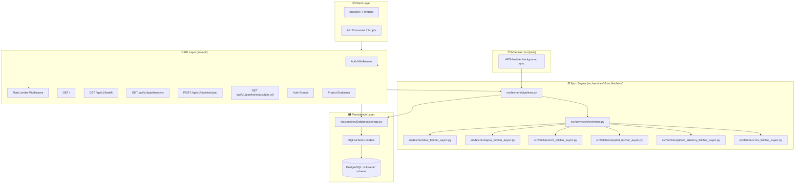

# VulnRadar — Project Description & Reference Guide

VulnRadar is an advanced asynchronous Python vulnerability intelligence service. It aggregates, enriches, and stores vulnerability data from multiple authoritative public sources to provide security teams with a unified view of threats.

---

## 📡 Threat Intelligence Data Sources

VulnRadar pulls data from multiple sources to build rich vulnerability profiles:

1. **CISA KEV (Known Exploited Vulnerabilities)**
   * **Purpose**: Primary source for actively exploited vulnerabilities.
   * **Source URL**: `https://www.cisa.gov/sites/default/files/feeds/known_exploited_vulnerabilities.json`
   * **Usage**: The pipeline downloads the full KEV catalog and processes each entry as a candidate for enrichment.

2. **EPSS (Exploit Prediction Scoring System)**
   * **Purpose**: Provides exploit probability and percentile ranking for CVEs.
   * **Source URL**: `https://epss.cyentia.com/epss_scores-current.csv.gz`
   * **Usage**: The service downloads and decompresses the CSV in-memory, then enriches records with `epss_score` and `percentile`.

3. **NVD (National Vulnerability Database)**
   * **Purpose**: Supplies canonical CVE metadata including CVSS scores, descriptions, references, weaknesses, and configuration details.
   * **Source URL**: `https://services.nvd.nist.gov/rest/json/cves/2.0`
   * **Usage**: The pipeline queries NVD per CVE to merge detailed vulnerability information into the KEV payload.

4. **Exploit Intelligence Sources**
   * **ExploitDB**: Searches the public ExploitDB JSON endpoint for PoC exploits.
   * **Metasploit Framework**: Uses GitHub Code Search against `rapid7/metasploit-framework` to identify active modules.
   * **PoC-in-GitHub**: Reads the nomi-sec PoC index from GitHub raw content.
   * **Usage**: These data sources create exploit reference evidence for each CVE.

5. **GitHub Advisory**
   * **Purpose**: Provides GitHub Security Advisory summaries, severity, and package context.
   * **Usage**: Enrichment runs only when a valid `GITHUB_TOKEN` is configured.

6. **OSV (Open Source Vulnerability Database)**
   * **Purpose**: Supplements NVD data with OSV-specific summaries, references, and severities.
   * **Usage**: Fetched from the OSV vulnerability endpoint for matching CVEs.

---

## 🏗️ Architecture & Component Layers

VulnRadar uses a layered design that separates API delivery, fetcher orchestration, enrichment logic, persistence, and scheduling.



### Core components

- `main.py`: starts the aiohttp web application, registers middleware, templates, and scheduler lifecycle hooks.
- `src/config/config.py`: loads environment variables, validates JWT secret, and builds the database URL.
- `src/config/database.py`: singleton SQLAlchemy connector with session factories and helper context managers.
- `src/api/router.py`: registers all API routes for health, sync, auth, and projects.
- `src/fetchers/pipelines.py`: orchestrates KEV fetching, enrichment, and persistence.
- `src/services/enrichment.py`: coordinates EPSS, NVD, exploit, GitHub Advisory, and OSV enrichment.
- `src/services/Database/storage.py`: persists enriched CVEs and child relations to PostgreSQL.
- `src/jobs/scheduler.py`: schedules periodic background sync jobs and manages the scheduler lifecycle.

---

## 🗂️ Directory Structure

```text
VulnRadar/
├── main.py
├── alembic.ini
├── requirements.txt
├── pyproject.toml
├── migrations/
├── scripts/
│   ├── insert_example_kev.py
│   └── reset_and_refill_cve_db.py
├── src/
│   ├── api/
│   │   ├── middleware/
│   │   │   ├── auth.py
│   │   │   └── rate_limiter.py
│   │   ├── v1/
│   │   │   ├── auth.py
│   │   │   ├── health.py
│   │   │   ├── pipeline.py
│   │   │   ├── projects.py
│   │   │   └── cve.py
│   │   └── router.py
│   ├── auth/
│   │   ├── jwt.py
│   │   └── users.py
│   ├── config/
│   │   ├── config.py
│   │   └── database.py
│   ├── fetchers/
│   │   ├── epss_fetcher_async.py
│   │   ├── exploit_fetcher_async.py
│   │   ├── github_advisory_fetcher_async.py
│   │   ├── kev_fetcher_async.py
│   │   ├── nvd_fetcher_async.py
│   │   ├── osv_fetcher_async.py
│   │   └── pipelines.py
│   ├── jobs/
│   │   ├── scheduler.py
│   │   └── tasks.py
│   ├── models/
│   │   ├── db_base.py
│   │   ├── cve.py
│   │   ├── cves.py
│   │   ├── cve_details.py
│   │   ├── cvss.py
│   │   ├── cvss_models.py
│   │   ├── epss.py
│   │   ├── exploit.py
│   │   ├── github_advisory.py
│   │   ├── osv.py
│   │   ├── projects.py
│   │   ├── reference.py
│   │   ├── sync_state.py
│   │   ├── users.py
│   │   ├── vendor_advisory.py
│   │   └── weakness.py
│   ├── services/
│   │   ├── Database/
│   │   │   └── storage.py
│   │   ├── enrichment.py
│   │   ├── logger.py
│   │   ├── rate_limiter.py
│   │   └── security.py
│   └── templates/
│       ├── gateway_status.html
│       └── sync_dashboard.html
└── frontend/                  # React/Vite frontend UI
```

---

## 🧩 Data Flow

1. `src/fetchers/pipelines.py` starts by downloading the KEV catalog from CISA.
2. The pipeline passes vulnerability records into `src/services/enrichment.py`.
3. Enrichment may include:
   * EPSS via `src/fetchers/epss_fetcher_async.py`
   * NVD via `src/fetchers/nvd_fetcher_async.py`
   * exploit intelligence via `src/fetchers/exploit_fetcher_async.py`
   * GitHub Advisory via `src/fetchers/github_advisory_fetcher_async.py`
   * OSV via `src/fetchers/osv_fetcher_async.py`
4. The populated payloads are persisted using `src/services/Database/storage.py`.
5. The database stores normalized child records for scores, references, weaknesses, configurations, and advisories.

---

## 🧪 Key Implementation Details

### Pipeline behavior

- `src/fetchers/pipelines.py` fetches KEVs and optionally filters by date range or incremental watermark.
- It supports manual sync windows via `start_date` / `end_date` and defaults to incremental mode when no dates are provided.
- Async progress callbacks update job state for the API dashboard.
- `DatabaseStorage.save_enriched_cves()` commits all records and updates KEV watermark state.

### Enrichment logic

- `src/services/enrichment.py` performs enrichment stages in sequence.
- EPSS enrichment is bulk and applies scores to every matching CVE.
- NVD enrichment is per-CVE and includes a 6.5 second delay per request to avoid API rate limits.
- Exploit enrichment aggregates data from ExploitDB, Metasploit, and PoC-in-GitHub.
- GitHub Advisory enrichment requires `GITHUB_TOKEN` and adds advisory summary, severity, package, and references.
- OSV enrichment adds OSV-specific summary, references, and severity tags.

### Persistence and ORM

- `src/services/Database/storage.py` persists `Cve` rows and child entities.
- It deletes old child records before writing fresh enriched data to ensure clean updates.
- Parent CVE fields include title, description, score, severity, publish dates, and vulnerability status.
- It saves relational child records for EPSS, exploit references, NVD CVSS metrics, weaknesses, configurations, OSV records, GitHub advisories, and vendor advisories.

### Schema and migrations

- Alembic is configured through `alembic.ini` and `migrations/env.py`.
- The DB schema is managed under `vulnradar`.
- Relevant migrations include:
  * moving tables into `vulnradar`
  * adding OSV / GitHub / vendor advisory tables
  * adding CVSS v4 sub-score columns
  * dropping unused columns such as `exploit_references.module` if present

---

## 🔧 API Endpoints

| Method | Endpoint | Description |
|---|---|---|
| `GET` | `/` | Gateway landing page with app status and health indicators |
| `GET` | `/api/v1/health` | Health check for the database, NVD key, and GitHub token |
| `GET` | `/api/health` | Alias of the health endpoint |
| `GET` | `/api/v1/pipeline/sync` | Sync dashboard page |
| `POST` | `/api/v1/pipeline/sync` | Start a background sync job. Optional body: `start_date`, `end_date` |
| `GET` | `/api/v1/pipeline/status/{job_id}` | Poll background sync status and progress |
| `POST` | `/api/v1/auth/register` | Register a new user and receive a JWT |
| `POST` | `/api/v1/auth/login` | Authenticate and receive a JWT |
| `GET` | `/api/v1/auth/me` | Validate JWT and return current user info |
| `POST` | `/api/v1/projects/add` | Create a new project for the authenticated user |
| `GET` | `/api/v1/projects` | List projects for the authenticated user |
| `GET` | `/api/v1/projects/{id}` | Retrieve a specific project |
| `POST` | `/api/v1/projects/{id}/items` | Add a CVE item to a project |
| `GET` | `/api/v1/projects/{id}/items` | List items in a project |
| `PATCH` | `/api/v1/projects/{id}/items/{cve_id}` | Update a project item |
| `DELETE` | `/api/v1/projects/{id}/items/{cve_id}` | Remove a project item |
| `PATCH` | `/api/v1/projects/{id}` | Update project metadata |
| `DELETE` | `/api/v1/projects/{id}` | Delete a project |

---

## 💡 Operational Notes

- `main.py` loads the aiohttp app and lifecycle context for scheduler startup/shutdown.
- `src/api/middleware/auth.py` verifies JWT tokens and secures protected endpoints.
- `src/api/middleware/rate_limiter.py` enforces rate limits at 60 requests per minute by default.
- `src/config/config.py` validates the JWT secret and builds the DB URL from `.env`.
- `scripts/reset_and_refill_cve_db.py` truncates CVE/enrichment tables and reruns the full sync pipeline.
- `src/models/cvss_models.py` includes CVSS v4 sub-score columns for `cvss_data_v40`.
- `src/services/Database/storage.py` persists `VendorAdvisory.vendor` and related advisory data.

---

## 🧠 Summary

VulnRadar is designed as an extensible, async threat intelligence ingestion platform with:

- KEV-first sync orchestration
- EPSS, NVD, exploit, GitHub Advisory, and OSV enrichment
- normalized PostgreSQL persistence under `vulnradar` schema
- background sync dashboard and job tracking
- JWT authentication and request rate limiting
- easy extension for new data sources and enrichment stages
